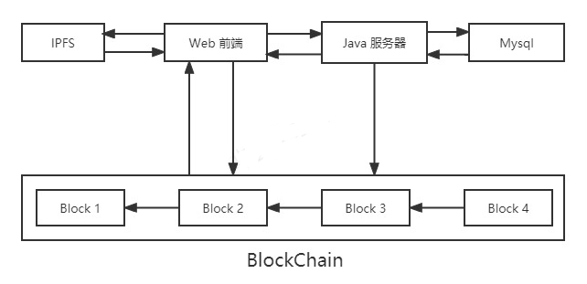

# ebay-truffle-auction

#### 这个分支是连接了Java后端的代码

## 声明：如有任何问题请联系wx：YQ-SmileATT

一个基于truffle搭建的拍卖系统项目，这个项目主要是基于以太坊开发拍卖系统DApp，拍卖的原理类似于eBay，所以又可以叫做“去中心化eBay”项目.

默认检测Metamask钱包插件，若有则使用MetaMask进行交互，若无则连接本地的8545端口.

## 应用架构图：



首先确保电脑已经安装**truffle、webpack、ganache-cli**

```
npm install -g truffle@5.7.4 webpack@5.75.0 ganache-cli@6.12.2
```

然后打开./app/package.json进行修改并安装相关包

```
// 这个是我的
{
  "name": "app",
  "version": "1.0.0",
  "description": "",
  "private": true,
  "scripts": {
    "build": "webpack",
    "dev": "webpack-dev-server"
  },
  "devDependencies": {
    "@openzeppelin/truffle-upgrades": "^1.17.0",
    "copy-webpack-plugin": "^5.0.5",
    "webpack": "^4.41.2",
    "webpack-cli": "^3.3.10",
    "webpack-dev-server": "^3.9.0"
  },
  "dependencies": {
    "@babel/core": "^7.20.12",
    "ipfs-http-client": "^50.1.2",
    "ethers": "^5.4.0",
    "web3": "^1.2.4"
  }
}
```

```
npm install
```

还要安装IPFS，[下载链接](https://dist.ipfs.tech/#kubo),我安装的版本是 kubo_v0.18.1

启动IPFS后，打开IPFS的[UI前端](http://localhost:5001/webui)，修改网关等配置文件并保存，然后重启IPFS

```
{
	"API": {
		"HTTPHeaders": {
			"Access-Control-Allow-Credentials": ["true"],
			"Access-Control-Allow-Headers": ["Authorization"],
			"Access-Control-Allow-Methods": ["GET","POST"],
			"Access-Control-Allow-Origin": ["*"],
			"Access-Control-Expose-Headers": ["Location"]
		}
	},
	"Addresses": {
		...
		"Gateway": "/ip4/127.0.0.1/tcp/9001",
		...
     }
     ...
}     
```

在启动 ganache-cli 、IPFS后，在项目根目录下使用 truffle 部署合约

```
truffle migrations
```

新增商品服务器时监听区块链状态，然后添加到mysql数据库中，我部署在我的Java服务器里了（[代码地址](https://github.com/kpyaoqi/JavaServer)）

如果Java不熟悉的话，也可以替换成直接查询区块链数据，或者自己有熟悉的后端语言的话也可以用其他的语言部署

在进行服务跳转的时候，会遇到跨域问题，需要在webpack.config.js文件添加一条代理配置：

```js
devServer: {
    contentBase: path.join(__dirname, "dist"),  compress: true,port: 8080,
    proxy: {
      '/**': {
        target: 'http://localhost:80',
        secure: false
      }
    }
  },
```

然后在项目app目录下启动项目

```
npm run dev
```

觉得不错的麻烦点一下Star,感谢^_^
